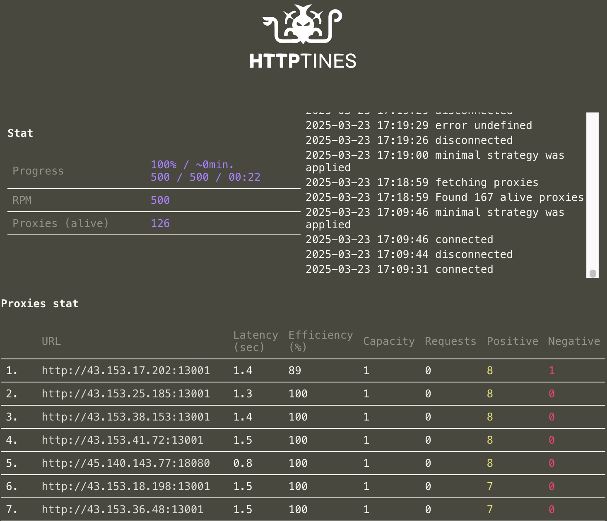

# httptines

[](https://pkg.go.dev/github.com/grishkovelli/httptines)
[](https://github.com/grishkovelli/httptines/blob/master/LICENSE)

**httptines** is a powerful Go package for sending HTTP requests using proxy servers. It provides an efficient and flexible way to handle web scraping tasks with automatic proxy management, load balancing, and real-time monitoring. The solution is highly concurrent and can handle thousands of simultaneous requests.



## Features

- Automatic proxy management and validation
- Smart load balancing with **minimal** and **auto** strategies
- Real-time monitoring via web interface
- User agent rotation and retry mechanism

## Automatic Proxy Management

The package automatically fetches and validates proxy servers from multiple sources. It continuously monitors proxy health and performance, automatically removing failing proxies and adjusting load based on their capabilities.

## Load Balancing

Two strategies are available for proxy utilization:
- **Minimal Strategy**: Single-threaded mode, ideal for proxies with limited concurrent connections
- **Auto Strategy**: Automatically determines optimal concurrent connections per proxy

## Real-time Monitoring

A built-in web interface provides real-time insights into:
- Proxy performance and health
- Success/failure rates
- Request latency
- Current throughput

## Installation

```bash
go get github.com/grishkovelli/httptines
```

## Example

```go
w := httptines.Worker{
    // Proxy selection strategy ("minimal" or "auto")
    Strategy: "minimal",

    // Request timeout in seconds (default: 10)
    Timeout:  5,

    // Proxy source URLs grouped by schema
    Sources: map[string][]string{
        "http": {
            "https://proxy-source-1/http.txt",
            "https://proxy-source-2/http.txt",
            "https://proxy-source-3/http.txt",
        },
    },

    // Optional configuration
    Interval: 300,      // proxy check interval in seconds (default: 120)
    Port: 8080,        // HTTP server port for web interface (default: 8080)
    Workers: 1000,       // Buffer size for proxy processing (default: 1000)
    StatInterval: 2,    // Statistics update interval in seconds (default: 2)
}

targets := []string{
  "target.com/page-1",
  "target.com/page-2",
  "target.com/page-n",
}

w.Run(targets, "https://target.com", func(body []byte) {
    // Process the response body
    // e.g., parse HTML, extract data, write to database
})
```

## Contributing

Contributions are welcome! Please feel free to submit a Pull Request.